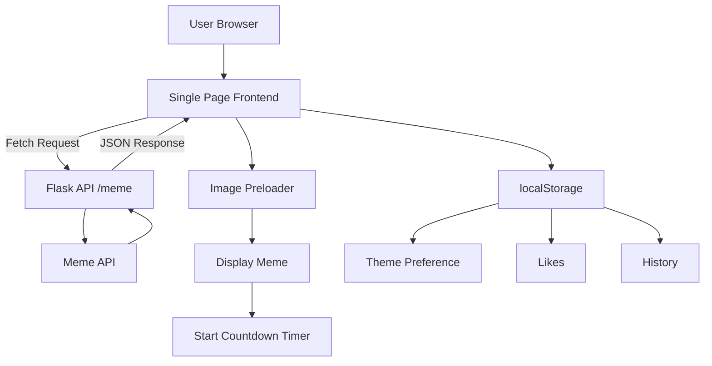

# Memeverse

**Modern Meme Web Application — Flask + JavaScript**

🌐 **Live Demo:** https://memeverse-y256.onrender.com/

---

## Overview

**Memeverse** is a lightweight, production-ready single-page web application designed to deliver fresh memes through a smooth, responsive, and distraction-free user experience.

The application focuses on **performance, simplicity, and thoughtful UX engineering** rather than framework complexity. Memes load asynchronously without page refreshes, images are preloaded to prevent flicker, and user preferences persist locally without requiring a database.

This project demonstrates practical backend API design, frontend state management, and real-world deployment practices using minimal tooling.

---

## Key Features

* **Single Page Experience** — Zero page reloads using Fetch API.
* **Image Preloading** — Eliminates flicker during meme transitions.
* **Smart Deduplication** — Backend caching avoids repeated memes.
* **Dark / Light Theme Toggle** — Monchrome UI with persistence.
* **Like System** — Save favorite memes locally.
* **History Viewer** — Browse last 10 viewed memes instantly.
* **Auto Refresh Timer** — Accurate countdown synced to image load.
* **Share Support** — Native Web Share API with clipboard fallback.
* **Responsive Design** — Works across desktop and mobile devices.
* **SEO Metadata** — Meta tags and favicon support.

---

## System Flow

### Application Architecture



---

## Design Decisions

### Image Preloading

Directly switching image sources causes visual flickering. Memeverse preloads memes using a hidden JavaScript `Image()` object and swaps only after loading completes.

Result:

* Smooth fade transitions.
* Consistent viewing experience.

---

### Timer Synchronization

The countdown timer begins **only after the meme fully loads**.

This ensures users always receive a complete viewing window instead of losing time during slow network requests.

---

### Client-Side Storage

User data is stored using browser `localStorage`.

Benefits:

* No database infrastructure.
* Faster performance.
* Zero hosting cost overhead.

Stored data includes:

* Theme preference
* Liked memes
* Viewing history.

---

### Backend Caching

A lightweight in-memory cache prevents recently viewed memes from appearing again during the same session.

---

## Technology Stack

**Backend**

* Flask
* Requests
* Gunicorn

**Frontend**

* JavaScript
* Tailwind CSS (CDN)

**API**

* meme-api.com

**Deployment**

* Render Web Services

**Storage**

* Browser localStorage.

---

## Project Structure

```text
memeverse/
│
├── app.py
├── requirements.txt
├── Procfile
├── runtime.txt
│
├── templates/
│   └── index.html
│
├── static/
│   ├── css/
│   │   └── styles.css
│   ├── js/
│   │   └── app.js
│   └── favicon.ico
│
└── docs/
    └── screenshots/
```

---

## Local Setup

### Requirements

* Python 3.10+
* Internet connection.

---

### Installation

Clone repository:

```
git clone https://github.com/<your-username>/memeverse.git
cd memeverse
```

Create virtual environment:

Windows:

```
python -m venv .venv
.\.venv\Scripts\Activate.ps1
```

macOS/Linux:

```
python3 -m venv .venv
source .venv/bin/activate
```

Install dependencies:

```
pip install -r requirements.txt
```

Run locally:

```
python app.py
```

Open:

```
http://127.0.0.1:5000
```

---

## Deployment (Render)

1. Push repository to GitHub.

2. Create a new Web Service on Render.

3. Configure:

Build Command:

```
pip install -r requirements.txt
```

Start Command:

```
gunicorn app:app
```

Render automatically deploys on every push.

---

## What This Project Demonstrates

* REST API integration using Flask.
* Async frontend updates without frameworks.
* Browser state management without databases.
* Production deployment configuration.
* UX-focused engineering decisions.

---

## Future Improvements

* Subreddit filtering.
* Progressive Web App support.
* Analytics dashboard.
* Optional authentication.

---

## Contact

GitHub: https://github.com/Lohith0204
LinkedIn: https://www.linkedin.com/in/sreelohith04/

---

**Built with ❤️ using Flask, Tailwind CSS, and JavaScript**.
